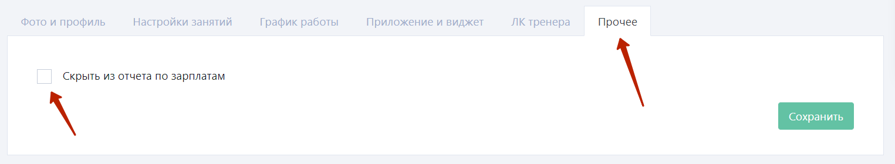

Чтобы создавать записи на занятия необходимо завести в учетную систему справочник инструкторов, которые будут проводить занятия. 

### 2.5.1. Создание карточки инструктора

Чтобы создать карточку инструктора, необходимо открыть в левом меню раздел **“Справочники и контент” => “Инструкторы”** и в правом верхнем углу нажать кнопку **“+Добавить”.**

В открывшейся форме добавления нового инструктора нужно заполнить необходимые поля: 

**Фамилия и имя,** которые будут отображаться для клиентов (единственное обязательное поле для сохранения карточки);

**Локации,** в которых может работать данный инструктор; 

**Номер телефона,** который необходимо указать, чтобы данный инструктор мог пользоваться личным кабинетом тренера (указывая при авторизации свой номер телефона). Также номер телефона понадобится, если настроить отправку уведомлений тренеров по СМС о записавшемся клиенте на персональную тренировку. И последнее: номер телефона тренера можно отобразить в мобильном приложении;

**E-mail** понадобится для настройки уведомлений тренера по почте о записавшихся клиентах на его занятия. Также e-mail тренера необходим для проведения персональных онлайн-тренировок (подробнее в разделе 15.2);

**Должность и биография** будут отображаться для клиентов в карточке инструктора, а также в карточке занятия, которое будет вести данный тренер. 
Далее нужно нажать кнопку **“Сохранить”.** 

После сохранения карточки появится возможность добавить фото инструктора, далее нужно нажать **“Сделать снимок”** или **“Загрузить фото”** справа в карточке тренера. Учитывайте разрешение: `640x480` и максимальный размер: 1Мб, загружаемого фото. 
Далее необходимо сохранить миниатюру, которая также будет отображаться в списке тренеров для ваших клиентов. 

### 2.5.2. Привязка тренера к персональным занятиям

Во вкладке **“Персональные занятия”** необходимо указать, какие персональные тренировки может вести данный инструктор. Если он может вести все тренировки вида “Персональное”, которые заведены в разделе “Справочники и контент” - “Занятия”, то галочку “Ведет все персональные занятия” необходимо оставить на месте. Если это не так, то данную галочку нужно убрать и указать, какие занятия может проводить этот тренер. 

### 2.5.3. График работы тренера

Далее необходимо добавить график работы новому инструктору, для этого в его карточке откройте вкладку **“График работы”** и отметьте в таблице его рабочие дни и часы зелеными ячейками. 
График работы необходим, чтобы клиенты могли самостоятельно записываться на персональные занятия через мобильное приложение или виджет онлайн-записи, именно указанное время в графике инструктора будет доступно для записи на персональную тренировку. 

##### Пример: Инструктор работает с понедельника по пятницу с 9 утра и до 9 вечера, при этом он имеет перерыв на обед.

Если тренер работает в нескольких локациях, то необходимо создать для каждой локации свой график работы. Если это не так, то можно оставить **график по умолчанию,** который будет использоваться во всех локациях. 

Также можно указать **“Временный график”** инструктора. 

Если тренеру не подходит постоянный график внутри одной недели, можно добавить **автозаполнение графика x через y.** 
Например, тренер будет работать 4 дня через 2 в течение следующих 10 недель с 10:00 до 20:00 с перерывом на обед. 

Далее нужно нажать кнопку **“Заполнить график”,** при этом в постоянный график данного инструктора автоматически сохранятся изменения согласно установленным параметрам автозаполнения графика. 
Чтобы внести изменения в постоянном графике инструктора на конкретную неделю, во вкладке “Временный график” в календаре нужно выбрать неделю, в таблице внести изменения на эту неделю. 

Например, тренер взял отгул на пятницу (сб и вс и так выходные): 

Далее нужно нажать кнопку **“Сохранить”** в правом нижнем углу страницы, после чего временные изменения в графике инструктора сохранятся. 
Чтобы в ручном режиме продлить временное изменение графика работы тренера на определенную неделю, нужно выбрать неделю нажатием на иконку календаря под таблицей графика временного изменения, а затем нажать кнопку “Ок”: 

При этом временные изменения графика сохранятся на выбранных двух неделях постоянного графика работы данного инструктора. 

Также в разделе **“временный график”** есть возможность создавать отпускные недели для тренеров. Для этого необходимо выбрать день в календаре слева и поставить галочку **“Отправить на неделю в отпуск”.**

### 2.5.4. Приложение и виджет

Далее во вкладке **“Приложения и виджет”** можно указать ссылки на социальные сети тренера. 

А также указать типы занятий, по которым этот тренер будет отображаться в мобильном приложении в разделе Инструкторы: 

Личный кабинет тренера подробно описан в разделе 12.6. todo

### 2.5.5. Прочее

В данной вкладке есть единственная галочка “Скрыть из отчета по зарплатам”, чтобы данный тренер не отображался в отчете по расчету заработной платы (п. 7.1.), например, при увольнении тренера. 

