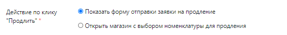
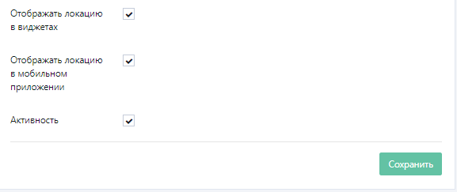
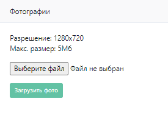

Прежде всего нужно создать локации, для этого нужно открыть в левом меню раздел **“Справочники и контент” => “Локации”.**

На странице управления локациями в правом верхнем углу нажать кнопку **“+Добавить”**. В открывшейся форме новой локации нужно заполнить необходимые поля: 

Поля, относящиеся к **“Основным”**, отображаются для клиентов в мобильном приложении, также здесь можно добавить логотип локации, который будет отображаться при выборе клуба. 

Также необходимо **указать технический E-mail**, на который будут приходить различные заявки от системы (например, о том, что записался клиент или поступила оплата). Здесь можно указать несколько электронных адресов через запятую.

Информация **“О локации”** также отображается для клиентов. Здесь необходимо указать график работы клуба и описание. Также здесь можно указать URL виртуального тура и web-сайта. Если указать **координаты** клуба, то в мобильном приложении появится кнопка **“Проложить маршрут”**, нажав на которую откроется приложение Google Maps или Яндекс.Карты, и отобразится путь до клуба. 

Информацию из раздела **“Адреса социальных сетей”** или **“Прочие”**  можно заполнить позже, после того, как будут разобраны остальные разделы. 
В разделе **“Адреса социальных сетей”**, соответственно, можно указать ссылки на социальные сети клуба, по которым смогут перейти клиенты. 

В разделе **“Прочие настройки”** можно управлять отображением **лицевого счета (депозита)** для клиентов в их личном кабинете. Если необходимо отключить отображение лицевого счета, возможность пополнять его, оплачивать услуги с лицевого счета и оплачивать долг, то нужно убрать соответствующие галочки.

В личном кабинете у клиента рядом с абонементом будет отображаться кнопка **“Продлить”**, здесь необходимо указать, что отобразится для клиента после нажатия на эту кнопку:

Если указать **предустановленную дату расписания,** клиентам начнет отображаться расписание с указанного числа (например, если клуб начинает работать только через пару недель). 

Можно выбрать **стандарт штрих-кодирования** клубных карт для клуба. Поддержано разделение на стандарты Code39, Code93, Code128, EAN13, EAN8.

По умолчанию в поле **“Отображать в мобильном приложении и виджетах загруженность”** стоит **отображать количество клиентов в клубе,** еще можно выбрать отображать **“Количество свободных мест в клубе”** или **“Не отображать”.** 
Также можно выбрать отображать загруженность в местах или процентах. Соответственно, при выборе отображения свободных мест в клубе, необходимо указать емкость локации, то есть максимальное количество клиентов, которое может находится в клубе. 

Если необходимо сделать так, чтобы локация перестала работать, то есть отображаться в виджете или в мобильном приложении, нужно убрать соответствующие галочки. 

После того, как вся информация будет заполнена, необходимо нажать на кнопку **“Сохранить”.**

После того, как локация будет сохранена, появится возможность добавить фотографии вашего клуба к локации, для этого нужно зайти в карточку клуба и в правом блоке **“Фотографии”** нажать на кнопку **“Выберите файл”,** после выбора файла нужно нажать на кнопку **“Загрузить фото”.** Добавленные фотографии появятся в карточке клуба.

Чтобы сделать одно из фото главным по умолчанию, нужно нажать на иконку звездочки в правом верхнем углу фотографии. 

