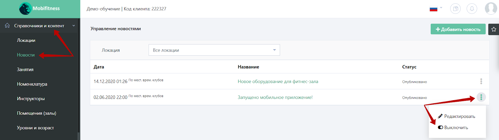

В административной панели можно добавить новости, которые будут отображаться для клиентов в мобильном приложении. Для этого нужно открыть в левом меню раздел **“Справочники и контент” => “Новости”.** Здесь будет отображаться новость “Запущено мобильное приложение!”, которая добавлена в системе по умолчанию.

Для того чтобы добавить другую новость (или несколько), в правом верхнем углу нужно нажать кнопку **“+Добавить новость”.** В открывшейся форме новой новости нужно заполнить необходимые поля:

Для публикации новости во всех локациях нужно оставить поле **“Локация”** пустым, в ином случае нужно выбрать клуб, для которого создается новость.
Далее необходимо заполнить название новости и загрузить фотографию. Загружаемая фотография должна соответствовать следующим условиям: иметь разрешение не более `640x480` пикселей и максимальный размер `не более 1 Мб.`
По умолчанию дата публикации равна дате создания новости. Но можно сделать отложенную публикацию. Для этого нужно выбрать день и время, в которые новость станет видимой.
Если новость должна быть видна только определенное время, то нужно выбрать в пункте **“Дата окончания видимости”** день и время,  в которые новость будет снята с публикации.
Ссылка на новость на сайте для шеринга автоматически подтягивается из настроек франшизы. Но здесь можно вручную добавить ссылку на конкретную новость.
Пункт **“Разослать оповещения посетителям локации”** будет распространяться только на тех клиентов, у кого есть мобильное приложение и в телефоне включена возможность получения push-уведомлений. 

После сохранения новости видна миниатюра загруженной фотографии.

Чтобы отключить новость, нужно перейти на страницу управления новостями. В списке новостей найти нужную новость и нажать на иконку с точками в конце строки данной новости, далее выбрать вариант **“Выключить”.**

В открывшемся окне **“Подтвердите отключение новости”** нажмите на кнопку **“Отключить”.** 

При этом откроется окно подтверждения действия. 

**Обращаем внимание,** что при включении новости обратно, пуш-рассылку надо будет создать вручную.
Чтобы включить отключенную новость, в списке новостей нужно найти нужную новость и нажать на иконку с точками в конце строки данной новости. В открывшемся окне **“Подтвердите включение новости”** нажмите на кнопку **“Включить”.**

Чтобы редактировать новость, нужно на страницу управления новостями. В списке новостей найти нужную новость и нажать на иконку с точками в конце строки данной новости, далее выбрать вариант **“Редактировать”.**

