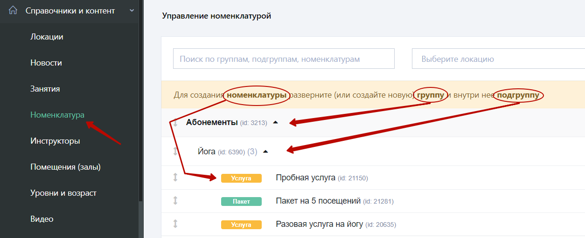
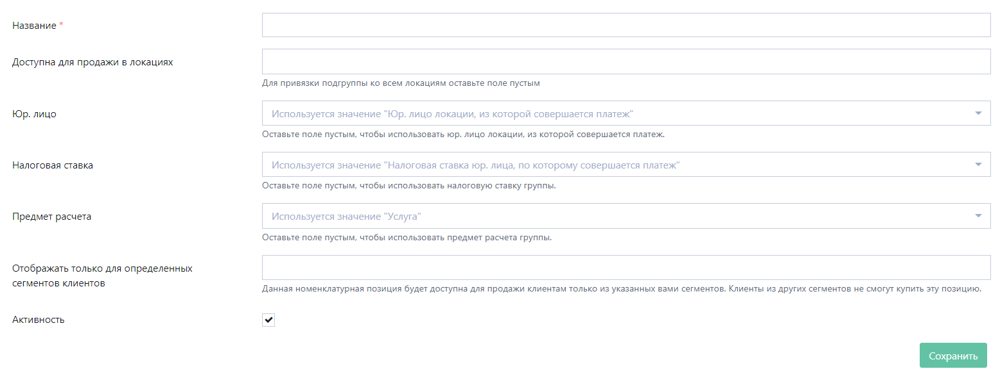
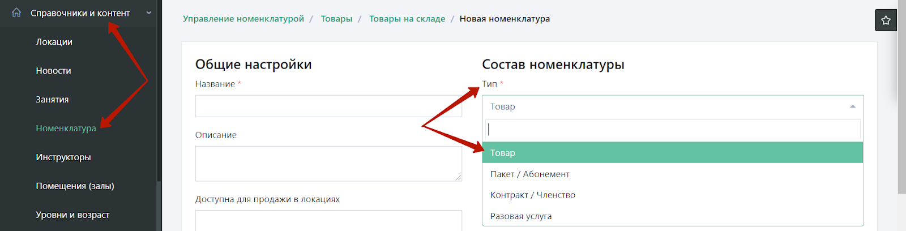
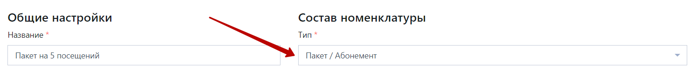
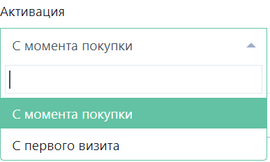
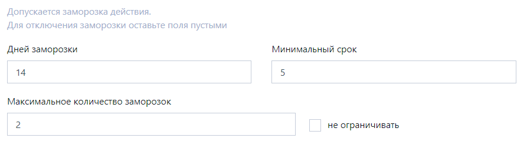
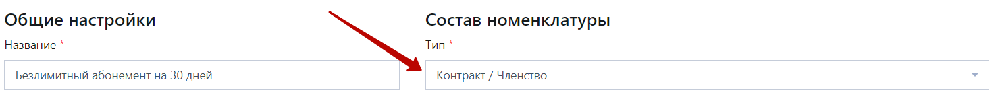

Справочник номенклатуры организован в виде трехуровневой системы. Номенклатуры строго привязаны к своим группам и подгруппам. 

#####Пример:
Группа **“Абонементы” => Подгруппа “Йога” => Разовая “Пробная услуга”**

####2.4.1. Заполнение справочника номенклатуры

Чтобы заполнить справочник номенклатуры, откройте в левом меню раздел **“Справочники и контент” => “Номенклатура”**

Заполнять справочник номенклатурных групп нужно по порядку, начиная с группы, затем нужно создать подгруппу и далее номенклатуры. Чтобы создать номенклатурную группу на странице управления номенклатурой в правом верхнем углу нажмите кнопку **“+Добавить группу”.**

Здесь нужно заполнить **название группы** (например, `“Абонементы”`, `“Акции”`, `“Товары”`). Далее можно указать **локацию**, в которой будут доступны номенклатуры данной группы для продажи. Если в клубе одна локация или номенклатуры могут продаваться во всех локациях клуба, советуем оставить данное поле пустым, таким образом, данная группа будет отображаться для всех локаций в системе (Далее поле “Локация” обсуждаться не будет, так как логика во всех объектах такая же). 
Далее можно указать **юридическое лицо**, через которое будут проводиться продажи. Если все абонементы могут продаваться через все юридические лица, то указывать его в номенклатурной позиции нет необходимости, так как юридическое лицо будет подгружаться автоматически из кассы, через которую будет проведена продажа. 
Более того, если в клубе появится новая локация, касса или другое юридическое лицо, то необходимо будет проверить все привязки юридических лиц в номенклатурных позициях, чтобы была возможность делать корректные продажи. 
**Налоговую ставку** и **предмет расчета** также не обязательно указывать. 

Здесь же можно указать, для каких **сегментов** необходимо отображать данный абонемент (подробнее о сегментах в разделе 3.1.2). Если это поле оставить пустым, данная группа будет отображаться для всех клиентов.

Поле **“Отображать только для определенных сегментов клиентов”** есть на каждом уровне (в группе, подгруппе и самой номенклатуре). 
Например, можно указать, что группа абонементов (или абонемент) будет отображаться только для лидов - клиентов, которые только попали в базу. Таким образом, можно создавать пробные абонементы, которые не будут отображаться для действующих членов клуба. 

Теперь в этой группе нужно создать номенклатурную подгруппу. Для этого в списке номенклатурных групп в строке группы нужно нажать на кнопку **“+ Добавить подгруппу”.**

Также как и в группе в подгруппе достаточно указать название (например, “безлимитные абонементы”, “дневные абонементы”), после нажать **“Сохранить”.** 

Далее необходимо создать конечный уровень номенклатуры, для этого в списке номенклатурных подгрупп в строке подгруппы нужно нажать на **“+ Добавить номенклатуру”.** 

В системе есть 4 типа номенклатур: **Товар, Пакет/Абонемент, Контракт/Членство и Разовая услуга.**

####2.4.2. Формирование товара 

Чтобы создать товар, в открывшейся форме в составе номенклатуры необходимо выбрать тип **“Товар”.**

Далее из обязательных полей нужно указать название самого товара (например, “Вода 0,5л”, “Коврик для йоги”) и стоимость. 

Также по желанию можно указать описание, заполнить поле “Доступна для продажи в локациях” и “Отображать только для определенных сегментов”. Галочка “Активность” выключает данную номенклатуру, после выключения она более не будет доступна для продажи. Юр. лицо, налоговую ставку и предмет расчета указывать не обязательно. 

**Обращаем внимание,** что товары клиенты не могут приобрести в мобильном приложении или виджете. Товары продаются только через административную панель Mobifitness. 

После того, как товар будет сохранен, он автоматически появится на **“Складе”** (“Склад” доступен для тарифов “Профессиональный” и “Все включено”). Подробнее о складе в разделе 5.4.

####2.4.3. Формирование разовой услуги

Чтобы создать разовую услугу, в открывшейся форме в составе номенклатуры необходимо выбрать тип **“Разовая услуга”.**

После этого нужно выбрать, какое занятие сможет посетить клиент, купив данную разовую услугу. Для этого нужно нажать на **“+ Добавить привязку к занятиям”,** после чего выбрать привязку: можно выбрать привязку ко всему направлению, типу или к одному конкретному занятию. Если клиент не оплатит услугу с соответствующей привязкой к занятию, он не сможет посетить данное занятие. 

Далее необходимо выбрать, в течение какого времени у клиента будет возможность использовать услугу после покупки (например, если после покупки клиент не воспользовался услугой в течение 7 дней, его услуга “сгорает”, и воспользоваться он уже ею не сможет).

Если установить галочку **“Разрешить использование только если у клиента есть другая активная услуга типа «Контракт»”,** то клиент сможет воспользоваться данной услугой только в том случае, если у клиента будет приобретен активный контракт (о контракте подробнее в разделе 2.4.5). Эта галочка необходима, если в клубе есть дополнительные услуги (например, солярий или массаж), и клиент может воспользоваться ими только при активном членстве/контракте. В других случаях данную галочку устанавливать не нужно. 

Далее можно указать коэффициенты для расчета заработной платы, на данный момент оставьте коэффициенты “100%” (подробнее о расчете заработной платы в разделе  7.1)

Если данную услугу клиенты не должны покупать самостоятельно в приложении и виджетах, нужно снять галочки **“Возможность купить в виджетах”** и **“Возможность купить в приложении”,** которые находятся в форме заполнения номенклатуры слева.

Далее из обязательных полей нужно указать **название** самой разовой услуги (например, “пробная услуга”, “разовое персональное занятие”) и **стоимость.**

####2.4.4. Формирование пакета

Чтобы создать Пакет, в открывшейся форме в составе номенклатуры, необходимо выбрать тип **“Пакет/Абонемент”**

Далее необходимо указать, какое количество раз клиент сможет посетить занятия, оплатив данный пакет.

Точно также, как и в разовой услуге (раздел 2.4.3) необходимо установить **привязку к занятиям.** Оплатив данный пакет, клиент сможет посетить только те занятия, которые будут привязаны к этому пакету. 

Далее необходимо выбрать, **в течение какого времени** у клиента будет возможность использовать посещения в данном пакете после активации (например, 5 посещений в пакете необходимо использовать в течение 30 дней, иначе они “сгорят”). 

Здесь же можно установить возможность **“Отнимать от срока действия (кол-во дней) при пропуске занятия”.** Т.е., если клиент забронировал за собой место, но не пришел на занятие, в системе есть возможность автоматически списывать с клиента определенное количество дней (например, с клиента спишется 2 дня из оставшихся активных дней в пакете в случае неявки на занятие). 

Также как и в разовой услуге (раздел 2.4.3), если установить галочку **“Разрешить использование только если у клиента есть другая активная услуга типа «Контракт»”,** то клиент сможет воспользоваться данным пакетом только в том случае, если у клиента будет приобретен активный контракт (о контракте подробнее в разделе 2.4.5). 

Далее необходимо выбрать, с какого момента пакет должен **активироваться:** с момента покупки или первого визита. Если выбрать **“С момента покупки”,** то как только клиент купит абонемент, срок действия сразу начнет действовать. 

Если выбрать **“с момента первого визита”,** то также можно указать дополнительные настройки: 

При установленной галочке **“Активировать принудительно при отметке визита в статус «Не пришел»”,** абонемент активируется в случае, если клиент записался на занятие, но не пришел на него;

При установленной галочке **“Активировать принудительно через...”,** абонемент активируется через то количество дней, которое будет указано, если клиент сам не посетит занятие в течение этого времени (например, если клиент не приходит после покупки абонемента, абонемент активируется автоматически через 30 дней и начнет отсчет срока действия);

При установленной галочке **“Разрешить клиентам самостоятельную активацию”,** клиент сможет зайти в свой личный кабинет и нажать “Активировать абонемент”. 

Следующая настройка относится к заморозке абонемента: 

**“Дней заморозки”** - это максимально количество дней, на которое можно заморозить данный абонемент; 
**“Минимальный срок”** - меньше, чем на указанное количество дней, невозможно будет заморозить данный абонемент
**“Максимальное количество заморозок”** - сколько раз можно замораживать этот абонемент.

#####Пример:
Ограничение: кол-во дней заморозки до 14, в одну заморозку входит не менее 5 дней, максимальное кол-во заморозок 2 штуки.
Клиент сможет заморозить абонемент только 2 раза, минимум на срок 5 дней за 1 раз (т.е. клиент не сможет заморозить абонемент на 1 день) и всего у него будет доступно 14 дней для заморозки. 

Если максимальное кол-во заморозок 1 штука, то после первой успешной разморозки баланс дней заморозки обнулится (успешная разморозка - это разморозка, которая произошла по прошествии минимального срока заморозки).

####Временной период действия пакета: 
Используется, например, для таких пакетов как “Дневной абонемент”. Для этого зелеными ячейками нужно указать то время, в которое абонемент будет действовать, а серыми, в которое, соответственно, не будет. 
Если абонемент действует в любое время, пока работает клуб, нужно оставить все ячейки пустыми. 
#####Пример: 
Абонемент действует с понедельника по пятницу до 15:00 включительно. 

*Примечание:* указывать время проведения групповых тренировок не нужно, для этого вы указываете привязку к занятиям. 

Далее можно указать коэффициенты для расчета заработной платы, на данный момент оставьте коэффициенты “100%” (подробнее о расчете заработной платы в разделе  7.1). 

Далее из обязательных полей нужно указать **название самого пакета** (например, “пакет на 5 посещений”) и **стоимость.**

####2.4.5. Формирование контракта

Чтобы создать контакт, в открывшейся форме в составе номенклатуры, необходимо выбрать тип **“Контракт/Членство”.**

Далее также, как и в разовой услуге и в пакете (разделы 2.4.3 и 2.4.4), необходимо привязать занятия к контракту (занятия, на которые сможет ходить клиент с данным абонементом). 
Главном функционалом контракта является возможность создавать **безлимитные абонементы** на определенный период времени. 
Также здесь вы можете указать не общее количество посещений, как в пакете, а для каждого занятия (или направления) по отдельности. 
#####Пример:
Безлимитный абонемент на групповые занятия, которые можно посещать в течение 30 дней. А также привязка к одному персональному занятию, посетив которое, повторно посетить его не будет возможности с данным абонементом.  

*Примечание:* списание услуг-оснований, при отметке визита, у клиента будет происходить в порядке от нижнего уровня до верхнего. 

#####Пример: В состав номенклатуры входит три уровня от меньшего к большему: занятие -> тип -> направление, по каждому уровню в контракт входит несколько посещений, как указано на скриншоте ниже.   
В данном случае при записи на такие занятия у клиента сначала спишутся два занятия “Йога на гамаках”, затем 2 занятия входящие в тип “Йога” и потом только 2 занятия входящие в направление “Групповые тренировки”.

Далее такие поля, как “Отнимать от срока действия (кол-во дней) при пропуске занятия”, “Активация”, “Заморозка”, “Действие в определенный период” работают точно также, как в типе “Пакет” (см. раздел 2.4.4). 
